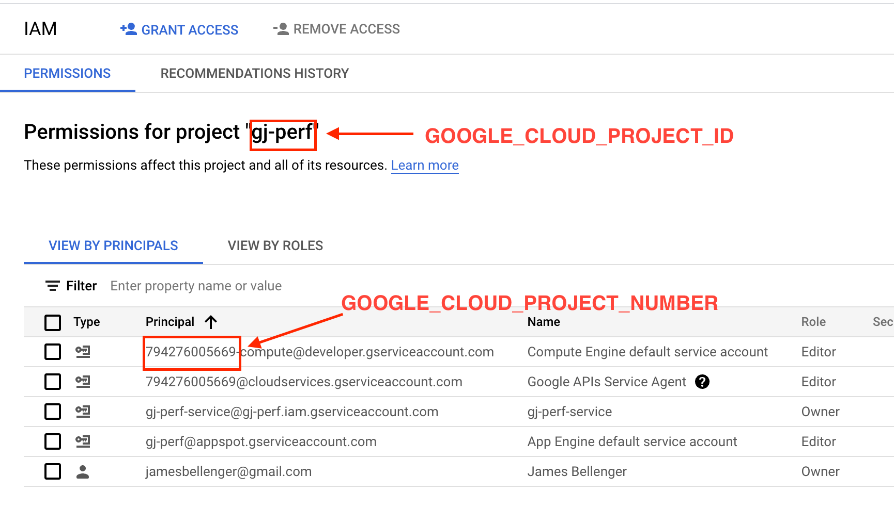

# JMB TODOs
  - cleanup backend readme
  - re-examine aws vs gcp
  - write new top-level readme
  - make machine types more configurable
  - add links to person names in readme


# GraphQL Java Test Runner

This project provides a system for running the graphql-java benchmark suite, durably record the result, and a web-based
tool for a human to analyze the result of multiple test runs.

The comnpute infrastructure used by this system can be divided into 2 categories:
- **permanent infra**: message queues, databases, and service accounts. These objects are setup once in GCP and can run forever at no cost.

- **per-run infra**: compute instances. These objects are setup for each test run and are destroyed after the test run finishes.
  By default these resources will fit into the GCP free tier, though the system can be configured to use different instance sizes that may incur additional costs.


### Terraform and GCP project Setup

  1. Install terraform from [Terraform](https://learn.hashicorp.com/tutorials/terraform/install-cli)
  1. Create a new GCP project.
  1. Add a billing account to the above created project.
  1. Enable these services on the project (APIs & Services -> Library):
    - [Compute Engine API](https://console.cloud.google.com/apis/library/compute.googleapis.com)
    - [Google Cloud Firestore API](https://console.cloud.google.com/apis/library/firestore.googleapis.com)
    - [App Engine Admin API](https://console.cloud.google.com/apis/library/appengine.googleapis.com)
  1. Create service account on IAM -> Service Account -> Create Service Account.
  1. Create a key for the service account. From the service account, select Keys -> Add Key -> Create new key -> Json
  1. Move the downloaded service account key to the terraform directory and rename it to `cred.json`.
  1. Assign the role Basic -> Owner to the new service account. This is done on IAM -> Manage Resources -> YOUR_PROJECT_NAME -> Add Principal. Add the email of the service account and select role "Basic -> Owner".
     The Owner (rather than Editor) role is required to create the firestore that holds test results.
  1. In the terraform directory, run:
  
    $ terraform init
    $ terraform apply
  

Terraform will create all the permanent infrastructure required by the test runner. This infra fits within the GCP 
free tier and can run forever at no cost.

### Github Project Configuration
These steps integrate the graphql-java-test-runner automation into a graphql-java repo. 
They can be applied to both the main repo ([graphql-java/graphql-java](https://github.com/graphql-java/graphql-java)) and forks of that repo.

1. Install workflow into graphql-java repo:
    ```
    $ cd path/to/graphql-java
    $ rsync -rv path/to/graphql-java-test-runner/dot-github/ .github/
    $ git commit -a -m 'installing graphql-java-test-runner workflow'
    ```
   
1. Configure the graphql-java github repo. In the github settings page for the graphql-java, repo, add these secrets:
   - `GOOGLE_CLOUD_PROJECT_ID` - the human-friendly name of your GCP project
   - `GOOGLE_CLOUD_PROJECT_NUMBER` - the numeric id of your GCP project. This can be seen in the IAM page as the numeric
     username for your service accounts



### React App

#### Installation

* In your terminal cd to test-runner-frontend folder.
* Run ```npm install``` to install all dependencies.

#### Run the app locally

* In your terminal cd to test-runner-frontend folder.
* Run ```npm start``` to run the app locally, then open this URL on your browser: http://localhost:3000/graphql-java-test-runner.
* To look at the code, just open up the project in your favorite code editor.

#### Run tests

* In your terminal cd to test-runner-frontend folder.
* To run all tests run ```npm tests```.
* To run all tests with coverage precentage run ```npm test -- --coverage```.

#### Deployment

* In your terminal cd to test-runner-frontend folder.
* Run ```npm run deploy```, then open this URL on your browser: https://adarsh-jaiswal.github.io/graphql-java-test-runner/
* NOTE: Changes might take up to 10 minutes to reflect.


# History
This system was first started at Twitter during the summer of 2022, by 2 excellent interns (TODO: Adarsh and Diego), and their mentor Chris Wright.
The system was finished at Airbnb in 2023 by jbellenger.
